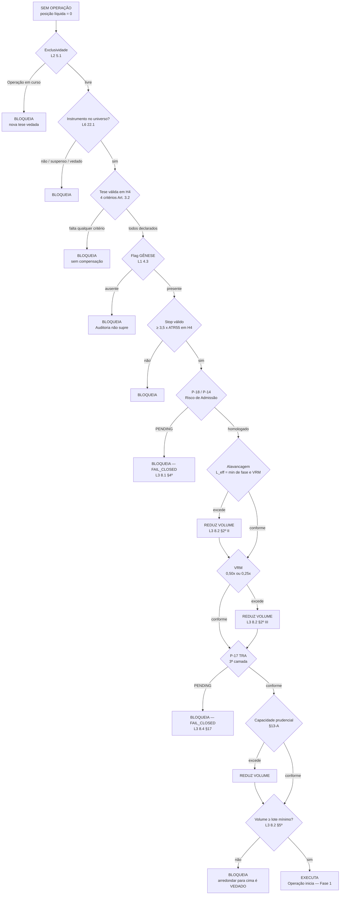
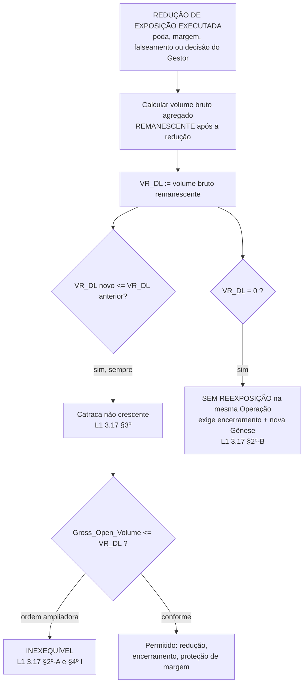
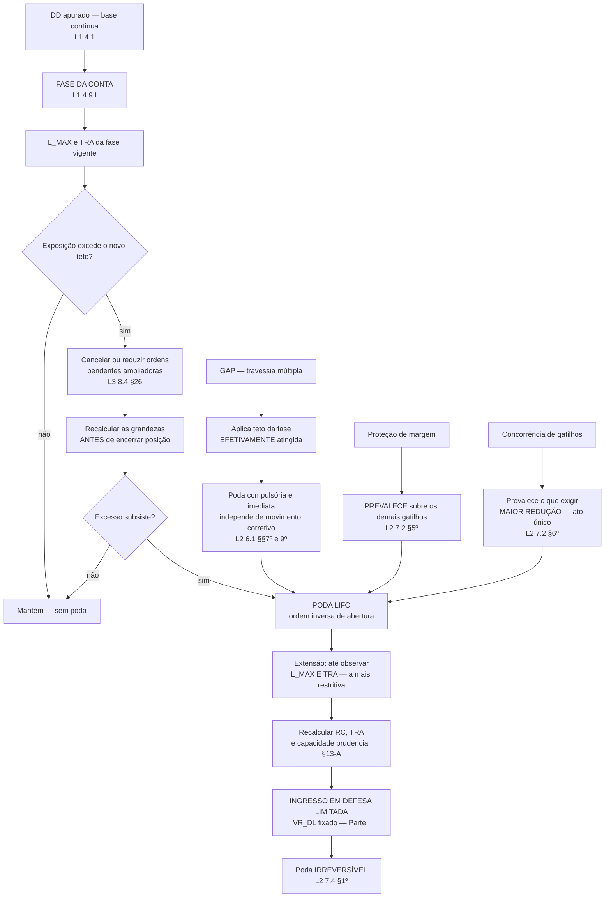

# ANEXO PARAMÉTRICO CANÔNICO

> **STATUS: VIGENTE — FONTE CANÔNICA DOS ELEMENTOS `DELEGATED_N3` IDENTIFICADOS NESTE ANEXO.**
> **VERSÃO:** JPW-ANNEX-T03 · 2026-09-03 · cutover formalizado pelo ato JPW-ANNEX-T03-CUTOVER-20260903; sucede o Anexo C nas matérias aplicáveis.
> **AUTORIDADE:** fonte canônica exclusivamente para N3 efetivamente delegados. Itens `MIRROR_*`, N0, N1, N2 e `INDETERMINATE / NON_N3` permanecem subordinados às respectivas normas hospedeiras.
>
> Este Anexo é **compressão fiel do Estatuto**, não fonte concorrente. Não cria regra, não preenche lacuna, não altera N0, N1 ou N2, não transforma `PENDING` em valor e não homologa nada. Havendo qualquer divergência entre este Anexo e o Livro/Artigo indicado, **prevalece o Estatuto**, e a divergência constitui defeito deste Anexo (L1 Art. 2.4 §4º; Constituição Art. I.7, IV).

---

# PARTE A — COMO LER ESTE ANEXO

## A.1 Finalidade

Permitir consulta operacional rápida — por pessoa ou por sistema — sem percorrer o Estatuto inteiro. Quatro funções simultâneas: dicionário de parâmetros (Parte C), dicionário de definições (Parte D), máquina de estados e fluxos (Partes G a J), mapa de remissões ao Estatuto (todas as partes).

## A.2 Precedência

```
CONSTITUIÇÃO  →  ESTATUTO (Livros)  →  este ANEXO  →  artefatos derivados
```

O Anexo nunca sobe nessa cadeia. Sua inclusão de um valor **não** produz homologação.

## A.3 `AUTHORITY_MODE` — classe de autoridade de cada item

| Modo | Significado |
|---|---|
| `DELEGATED_N3` | Elemento efetivamente delegado pela norma hospedeira à governança paramétrica. Após o cutover, este Anexo é sua fonte canônica (`CANONICAL_SOURCE`). Canonicidade não é homologação: `CANONICAL ≠ HOMOLOGATED`. |
| `MIRROR_N2` | Regra, limite, conduta, protocolo ou valor **N2** reproduzido em resumo apenas para consulta. **O Anexo não tem autoridade para alterá-lo.** Fonte autoritativa = Livro/Artigo indicado. |
| `MIRROR_N1` | Doutrina resumida para orientação interpretativa. Não cria obrigação autônoma. |
| `MIRROR_N0` | Invariante, cláusula pétrea ou regra constitucional resumida para orientação. Sem autoridade autônoma. |
| `PENDING_N3` | Elemento delegado, **sem valor homologado**. |
| `DERIVED / NON_N3` | Grandeza obtida por operação determinística sobre elementos já determinados por norma superior. Não calibra, não homologa, não cria autoridade e **não determina** as grandezas de que deriva. Não constitui parâmetro independente e não integra a contagem N3. |
| `INDETERMINATE / NON_N3` | Elemento sem classe paramétrica declarada e fora da governança N3; não conta como parâmetro delegado. |

## A.4 Níveis normativos (Constituição, Art. I.6)

`N0` identidade e cláusulas pétreas · `N1` doutrina · `N2` norma vinculante de conduta · `N3` calibração delegada · artefatos derivados **não** constituem nível.

## A.5 Estados

| Estado | Significado |
|---|---|
| `VIGENTE` | Produz efeito normativo hoje. |
| `HOMOLOGATED` | Satisfaz os **cinco** requisitos do Art. **I.6, X**: valor determinado; fonte e classe identificáveis; aprovação pela autoridade competente; vigência definida; ausência de bloqueio por condição pendente superior. |
| `NOT_HOMOLOGATED` | Valor existe e opera, mas não satisfaz os cinco requisitos. |
| `PENDING` | Sem valor. **PENDING não é zero. PENDING não é fallback. PENDING não é autorização implícita.** |
| `ratificado; ata pendente` | Valor ratificado pela autoridade competente, com ata de ratificação ainda não lavrada. **Não equivale a `HOMOLOGATED`** — falta o requisito de aprovação registrada do Art. I.6, X. Vinculado a `RAT-1`. |
| `NOT_VALIDATED` | Sem validação matemática e/ou empírica. Não impede vigência; não é escondido. |
| `FAIL_CLOSED` | A ausência do elemento **veda a conduta** que dele depende. Fundamento: L1 Art. 2.5 §5º e Constituição Art. **I.7, V** — *"não se presume autorização, parâmetro, exceção ou obrigação inexistente"*. |

## A.6 Quatro estados epistemológicos, nunca confundidos

```
DOCUMENTALMENTE RESOLVIDO ≠ NORMATIVAMENTE RESOLVIDO
                          ≠ MATEMATICAMENTE VALIDADO
                          ≠ EMPIRICAMENTE VALIDADO
```

---

# PARTE B — PAINEL EXECUTIVO

| ID | ITEM | VALOR / ESTADO | CLASSE | AUTHORITY_MODE | EFEITO |
|---|---|---|---|---|---|
| `X-DD-MAX` | Limite operacional máximo de DD | existência N2; valor corrente **22,00%** | valor N3 | `DELEGATED_N3` | Encerramento compulsório em `DD ≥ 22,00%` |
| `X-PHASES` | Faixas internas das seis fases | 0–2 / 2,01–6 / 6,01–10 / 10,01–14 / 14,01–18 / 18,01% → `DD_MAX` | N2 | `MIRROR_N2` | Determina fase aplicável |
| `X-LEV` | Tetos de alavancagem por fase | 1,0 / 4,0 / 2,4 / 1,4 / 0,8 / 0,4x | N2 | `MIRROR_N2` | Teto por fase; poda ao romper |
| `X-H4` | Horizonte decisório | **H4** (gráfico de 4 horas) | N0/N2 — identidade | `MIRROR_N2` | Único horizonte decisório |
| `X-H1` | Horizonte de execução | **H1** (gráfico de 1 hora) | identidade | `MIRROR_N2` | Refino, gatilho, janela de poda. **Sem autoridade sobre a tese** |
| `X-D1` | Contexto direcional superior | **D1**, auxiliar | identidade | `MIRROR_N2` | Facultativo. **Não satisfaz critério do Art. 3.2** |
| `X-STOP` | Stop mínimo normativo | **≥ 3,5 × ATR(55)** em H4 | N3 | `DELEGATED_N3` | Distância mínima válida |
| `X-VRM-L` | Alavancagem por regime VRM | **0,50x** normal · **0,25x** restritivo | **N2** | `MIRROR_N2` | Alavancagem por ordem |
| `X-GEN-R` | Risco de Admissão da Gênese | **PENDING** | N3 | `PENDING_N3` | **FAIL_CLOSED — nenhuma Gênese admissível** |
| `X-TRA` | Teto de Risco Agregado da Fase | **PENDING** | N3 | `PENDING_N3` | **FAIL_CLOSED — terceira camada indemonstrável** |
| `X-DL` | Defesa Limitada / VR_DL | VIGENTE, sem parâmetro | N2 | `MIRROR_N2` | Catraca não crescente sobre volume bruto |
| `X-QUAR` | Quarentena Operacional | VIGENTE · duração mínima **PENDING** | N2 + N3 | `MIRROR_N2` | Retorno vedado até ato do Compliance Board |
| `X-FCR` | Fundo de Contingência e Reconstituição | limite máximo vigente × SI (**22,00%** do SI sob o limite vigente) | **N2** | `MIRROR_N2` | Vinculado a `X-DD-MAX` por recálculo automático |
| `X-FEO` | Fundo de Estabilidade Operacional | **seis meses** de despesas operacionais reais · montante **PENDENTE DE APURAÇÃO** | **N2** | `MIRROR_N2` | Percentual sobre o SI é informação derivada; sem total segregado consolidado |
| `X-FW` | Firewall de replicação | fórmula **DEFINED** · entradas **PENDING** | N2 | `MIRROR_N2` | **Replicação vedada** até homologação |
| `X-CAT` | Catraca — percentual segregado | **PENDING** | N3 | `PENDING_N3` | Condição de eficácia sem valor. **Janela: virada de ciclo** |
| `X-EMERG` | Protocolo de Emergência | VIGENTE — L2 6.3-A | N2 | `MIRROR_N2` | Vedada nova Operação e nova Gênese |
| `X-INVAL` | Recuperação de Estado Inválido | VIGENTE — L1 4.11 | N2 | `MIRROR_N2` | Vedada ampliação; estado mais restritivo |
| `X-UNIV` | Universo de instrumentos | **8 pares** · US500 suspenso · metais **vedados** | N2 | `MIRROR_N2` | Fora do universo ⟹ vedado |

**Principais `PENDING` com efeito `FAIL_CLOSED`:** `P-05` · `P-07` · `P-08` · `P-10` · `P-17` · `P-18` · `P-25` · `P-26`. Detalhe na **Parte M**.

---

# PARTE C — DICIONÁRIO PARAMÉTRICO

Legenda de colunas: `HOST_NORM` norma que cria, define, disciplina ou delega o elemento · `CANONICAL_SOURCE` local vigente onde o estado paramétrico é registrado — para todo `DELEGATED_N3` e `PENDING_N3`, este Anexo, **inclusive quando o estado é `PENDING`** · `PROVENANCE` origem histórica do valor/estado, sem autoridade operacional · `HOMOLOGATION_STATUS` estado de homologação, eixo independente da canonicidade (`CANONICAL ≠ HOMOLOGATED`) · `MAT` validação matemática · `EMP` validação empírica · `EFF` efeito operacional se pendente.

## C.1 Itens e estados paramétricos

| PARAM_ID | NOME | VALOR / ESTADO | UNID. | CLASSE | AUTHORITY_MODE | HOST_NORM | CANONICAL_SOURCE | PROVENANCE | HOMOLOGATION_STATUS | MAT | EMP | EFF | DEPENDÊNCIAS | OBS |
|---|---|---|---|---|---|---|---|---|---|---|---|---|---|---|
| **P-01** | Faixas internas das fases | 0–2 / 2,01–6 / 6,01–10 / 10,01–14 / 14,01–18 / 18,01% → DD_MAX | % do SI | N2 | `MIRROR_N2` | L2 6.1 §1º | L2 6.1 tabela | — | N/A | PARTIAL | NOT_VAL | — | P-03 | Não integra a contagem N3. |
| **P-02** | Tetos de alavancagem por fase | 1,0 / 4,0 / 2,4 / 1,4 / 0,8 / 0,4 | x | N2 | `MIRROR_N2` | L2 6.1 §1º | L2 6.1 tabela | — | N/A | PARTIAL | NOT_VAL | — | P-01, P-17 | Não integra a contagem N3; monotonicidade permanece estrutural. |
| **P-03** | Valor do limite operacional máximo de DD | **22,00** | % do SI | valor N3; existência N2 | `DELEGATED_N3` | L2 6.1; Const. I.6 §2º | ANEXO PARAMÉTRICO CANÔNICO | CUTOVER_T03 \| PRE_CUTOVER_SOURCE=candidate \| VALUE_STATE_PRESERVED | NOT_HOM | PARTIAL | NOT_VAL | — | P-01, FCR, §13-A, P-30 | calibração candidata em vigência. |
| **P-04a** | Histerese — margem | **0,50 p.p.** | p.p. de DD | N3 | `DELEGATED_N3` | L1 4.1 §§5º e 10 | ANEXO PARAMÉTRICO CANÔNICO | CUTOVER_T03 \| PRE_CUTOVER_SOURCE=candidate \| VALUE_STATE_PRESERVED | NOT_HOM | NOT_VAL | NOT_VAL | — | P-01 | — |
| **P-04b** | Histerese — candles de confirmação | **1** | candles H4 | N3 | `DELEGATED_N3` | L1 4.1 §§5º e 10 | ANEXO PARAMÉTRICO CANÔNICO | CUTOVER_T03 \| PRE_CUTOVER_SOURCE=candidate \| VALUE_STATE_PRESERVED | NOT_HOM | NOT_VAL | NOT_VAL | — | P-01 | H4 não é N3. |
| **P-05** | Prazo de posição zerada sem confirmação | **PENDING** | tempo | N3 | `PENDING_N3` | L1 4.4 §3º | ANEXO PARAMÉTRICO CANÔNICO | CUTOVER_T03 \| PENDING_STATE_PRESERVED \| NO_VALUE_CREATED | NOT_HOM | N/A | N/A | **FAIL_CLOSED** — Operação subsiste; exclusividade mantida | — | Sem fallback |
| **P-06** | Critério objetivo de tendência persistente | **PENDING** | métrica | N3 | `PENDING_N3` | L1 3.13 §5º | ANEXO PARAMÉTRICO CANÔNICO | CUTOVER_T03 \| PENDING_STATE_PRESERVED \| NO_VALUE_CREATED | NOT_HOM | N/A | N/A | Presunção normativa expressa (L1 3.13 §5º): presume-se regime persistente ⟹ **Defesa vedada** | P-07 | Fail-closed por presunção expressa |
| **P-07** | Número máximo de defesas por Operação | **PENDING** | contagem | N3 | `PENDING_N3` | L1 3.13 §9º | ANEXO PARAMÉTRICO CANÔNICO | CUTOVER_T03 \| PENDING_STATE_PRESERVED \| NO_VALUE_CREATED | NOT_HOM | N/A | N/A | **FAIL_CLOSED** — irrelevante hoje: Defesa já vedada por P-06 | P-06 | Sem fallback |
| **P-08** | Teto acumulado da Margem Operacional Reposta | **PENDING** | % do SI | N3 | `PENDING_N3` | L1 3.16 §2º | ANEXO PARAMÉTRICO CANÔNICO | CUTOVER_T03 \| PENDING_STATE_PRESERVED \| NO_VALUE_CREATED | NOT_HOM | N/A | N/A | **FAIL_CLOSED** — MOR inexequível (§5º, IV) | P-09 | Artigo de vigência condicionada (§§13–14) |
| **P-09** | Amostra mínima para revisão do Art. 3.16 | **PENDING** | contagem | N3 | `PENDING_N3` | L1 3.16 §13 | ANEXO PARAMÉTRICO CANÔNICO | CUTOVER_T03 \| PENDING_STATE_PRESERVED \| NO_VALUE_CREATED | NOT_HOM | N/A | N/A | Efeito normativo expresso (L1 3.16 §14): ausência de deliberação ⟹ **revogação automática** | P-08 | — |
| **P-10** | Percentual segregado para reservas (Catraca) | **PENDING** | % do resultado | N3 | `PENDING_N3` | L1 3.19 §5º | ANEXO PARAMÉTRICO CANÔNICO | CUTOVER_T03 \| PENDING_STATE_PRESERVED \| NO_VALUE_CREATED | NOT_HOM | N/A | N/A | **FAIL_CLOSED** — segregação inexequível; **condição de eficácia** da Catraca | FCR, FEO | `TIME_BOUND = YES`; trigger: próxima fixação do Saldo Inicial de Referência. |
| **P-11** | VRM — períodos de apuração | **ATR 55** e **ATR 660**, em H4 | períodos | N3 | `DELEGATED_N3` | L1 4.10 §1º | ANEXO PARAMÉTRICO CANÔNICO | CUTOVER_T03 \| PRE_CUTOVER_SOURCE=corpo — L3, seção VRM \| VALUE_STATE_PRESERVED | NOT_HOM | PARTIAL | NOT_VAL | — | P-16 | VRM.ATR_SHORT_PERIOD = 55; independente de P-16. |
| **P-12a** | VRM — limiares de classificação | `VRM < 1,20` · `1,20 ≤ VRM ≤ 1,50` · `VRM > 1,50` | razão ATR curto/longo | N3 | `DELEGATED_N3` | L1 4.10 §1º | ANEXO PARAMÉTRICO CANÔNICO | CUTOVER_T03 \| PRE_CUTOVER_SOURCE=corpo — L3, tabela VRM \| VALUE_STATE_PRESERVED | ratificado; **ata pendente** | NOT_VAL | NOT_VAL | — | P-11, P-13 | Delegação expressa |
| **P-12b** | **VRM — alavancagem por regime** | **0,50x** normal · **0,25x** transição e alta vol. | x por ordem | **N2** | **`MIRROR_N2`** | L3, tabela VRM | corpo — L3 | — | **N/A — não é matéria paramétrica** | NOT_VAL | NOT_VAL | — | P-15, P-02 | **Ver C.3 — reclassificação** |
| **P-13** | VRM — periodicidade de recálculo | **PENDING** | tempo | N3 | `PENDING_N3` | L1 4.10 §1º; L9 Anexo C 1.2 | ANEXO PARAMÉTRICO CANÔNICO | CUTOVER_T03 \| PENDING_STATE_PRESERVED \| NO_VALUE_CREATED | NOT_HOM | N/A | N/A | Sem efeito autônomo | P-12a | PROPOSTA SEM VIGÊNCIA: semanal, sexta, H4. Não é valor, não é fallback, não autoriza conduta. |
| **P-14** | Limite de risco da Ordem Gênese (**r**) | **PENDING** | % do SI | N3 | `PENDING_N3` | L3 8.1, I | ANEXO PARAMÉTRICO CANÔNICO | CUTOVER_T03 \| PENDING_STATE_PRESERVED \| NO_VALUE_CREATED | NOT_HOM | N/A | N/A | **FAIL_CLOSED** — L3 8.1 §4º: operação vedada | P-18, P-20, P-02 | Histórico sem vigência: 1,00% do SI (V10) |
| **P-15** | Alavancagem máxima da Ordem Gênese | **1,0x** por remissão ao teto da Fase 1 | x | remissão | `MIRROR_N2` | L3 8.1, II → L2 6.1 | corpo — L2 6.1 | — | N/A | N/A | NOT_VAL | — | P-02, P-12b | Mérito resolvido; ver C.3 e `HA-04` |
| **P-16** | Período do ATR do stop | **55** | períodos H4 | N3 | `DELEGATED_N3` | L3 9.5 §1º | ANEXO PARAMÉTRICO CANÔNICO | CUTOVER_T03 \| PRE_CUTOVER_SOURCE=corpo — L3 9.5 \| VALUE_STATE_PRESERVED | NOT_HOM | PARTIAL | NOT_VAL | — | P-11, P-20 | STOP.ATR_PERIOD = 55; independente de P-11. |
| **P-17** | Teto de Risco Agregado da Fase | **PENDING** | % do SI | N3 | `PENDING_N3` | L3 8.4 §13 | ANEXO PARAMÉTRICO CANÔNICO | CUTOVER_T03 \| PENDING_STATE_PRESERVED \| NO_VALUE_CREATED | NOT_HOM | N/A | N/A | **FAIL_CLOSED** — 8.4 §17 exige pro forma das três camadas | P-14, P-18, P-19 | Restrições vigentes: §14 não crescente; §13-A prudencial |
| **P-18** | Risco de Admissão por fase (1ª camada) | **PENDING** | % do SI | N3 | `PENDING_N3` | L3 8.4 §13 | ANEXO PARAMÉTRICO CANÔNICO | CUTOVER_T03 \| PENDING_STATE_PRESERVED \| NO_VALUE_CREATED | NOT_HOM | N/A | N/A | **FAIL_CLOSED** — nenhuma Ordem Gênese admissível | P-14, P-17 | Ver C.2 |
| **P-19** | Degraus e distribuição de volume (**M**) | **PENDING** | contagem / % | N3 | `PENDING_N3` | L3 9.2 §4º | ANEXO PARAMÉTRICO CANÔNICO | CUTOVER_T03 \| PENDING_STATE_PRESERVED \| NO_VALUE_CREATED \| PRE_CUTOVER_SOURCE=declaração prévia por Operação | NOT_HOM | N/A | N/A | Regra normativa expressa (L1 4.7; L3 9.2 §§4º–5º): declaração prévia obrigatória; degrau não declarado **vedado** | P-14, P-17 | `M ≤ teto_fase / L_g` é **teto derivado**, não valor |
| **P-20** | Múltiplo mínimo de amplitude verdadeira (stop) | **3,5 × ATR(55)**, em H4 | múltiplo | N3 | `DELEGATED_N3` | L3 9.5 §§4º–7º | ANEXO PARAMÉTRICO CANÔNICO | CUTOVER_T03 \| PRE_CUTOVER_SOURCE=corpo — L3 9.5 \| VALUE_STATE_PRESERVED | ratificado; **ata pendente** | PARTIAL | NOT_VAL | — | P-16, P-14 | Histórico sem vigência: 2,0 × ATR(55) |
| **P-21** | Fator de segurança F (Raiz-N) | **PENDING** | fator | N3 | `PENDING_N3` | L3 Raiz-N; L9 Anexo C 1 | ANEXO PARAMÉTRICO CANÔNICO | CUTOVER_T03 \| PENDING_STATE_PRESERVED \| NO_VALUE_CREATED | NOT_HOM | N/A | N/A | Nenhum — modelo é **diagnóstico**, sem efeito de veto | P-22 | PROPOSTA SEM VIGÊNCIA: 1,25. Não é valor, não é fallback, não autoriza conduta. Faixa 1,5–2,0 = referência histórica sem efeito |
| **P-22** | N — candles do modelo Raiz-N | **INDETERMINATE** — estimado caso a caso | candles H4 | `INDETERMINATE` | `INDETERMINATE / NON_N3` | L3, seção Raiz-N | L3, seção Raiz-N | — | — | N/A | N/A | Nenhum — diagnóstico | P-21 | Não cria valor, fallback ou governança paramétrica; não integra a contagem N3. |
| **P-23** | Buffer de descontinuidade (gap e deslizamento) | **PENDING** | % do SI | N3 | `PENDING_N3` | L3 8.4 §13-A | ANEXO PARAMÉTRICO CANÔNICO | CUTOVER_T03 \| PENDING_STATE_PRESERVED \| NO_VALUE_CREATED | NOT_HOM | N/A | N/A | Declarado na norma: **risco residual não coberto**. **Não** há valor zero homologado | P-17 | Norma declara a própria ausência |
| **P-24** | Duração mínima da Quarentena Operacional | **PENDING** | tempo | N3 | `PENDING_N3` | L2 6.5 §4º | ANEXO PARAMÉTRICO CANÔNICO | CUTOVER_T03 \| PENDING_STATE_PRESERVED \| NO_VALUE_CREATED | NOT_HOM | N/A | N/A | Efeito normativo expresso (L2 6.5 §4º): retorno operacional **vedado** enquanto o parâmetro não estiver homologado | — | Histórico sem vigência: 90 dias. L4 13.3 §3º **veda** inferi-la do prazo do FEO |
| **P-25** | Prazo máximo de espera por movimento corretivo | **PENDING** | tempo | N3 | `PENDING_N3` | L2 7.2 §2º | ANEXO PARAMÉTRICO CANÔNICO | CUTOVER_T03 \| PENDING_STATE_PRESERVED \| NO_VALUE_CREATED | NOT_HOM | N/A | N/A | **FAIL_CLOSED** — poda **imediata** (L2 7.1 caput; 7.2 §4º) | P-26 | Sem fallback |
| **P-26** | Gatilho compulsório por avanço | **PENDING** | fração da largura da fase | N3 | `PENDING_N3` | L2 7.2 §3º | ANEXO PARAMÉTRICO CANÔNICO | CUTOVER_T03 \| PENDING_STATE_PRESERVED \| NO_VALUE_CREATED | NOT_HOM | N/A | N/A | **FAIL_CLOSED** — idem P-25 | P-25 | Histórico sem vigência: +1,00 p.p. |
| **P-27** | Liquidez do FCR | **D+0 / D+1** | prazo | N3 | `DELEGATED_N3` | L4 13.2 §7º delega | ANEXO PARAMÉTRICO CANÔNICO | CUTOVER_T03 \| PRE_CUTOVER_SOURCE=candidate \| VALUE_STATE_PRESERVED | NOT_HOM | N/A | N/A | — | P-28 | L7 26.3 não é fonte concorrente. |
| **P-28** | Liquidez do FEO | **até D+2** | prazo | N3 | `DELEGATED_N3` | L4 13.3 §11 delega | ANEXO PARAMÉTRICO CANÔNICO | CUTOVER_T03 \| PRE_CUTOVER_SOURCE=candidate \| VALUE_STATE_PRESERVED | NOT_HOM | N/A | N/A | — | P-27 | L7 26.3 não é fonte concorrente. |
| **P-29** | Percentual equivalente do FEO sobre o SI | **DERIVED** — `FEO_REQUIRED_AMOUNT / SI`; `NOT_COMPUTABLE_UNTIL_INPUTS_AVAILABLE` | % do SI | DERIVED — não normativa | `DERIVED / NON_N3` | L4 13.3 §§1º e 5º | L4 13.3 — grandeza derivada; este Anexo não registra valor | — | N/A | N/A | N/A | Nenhum — representação; **não determina o montante exigido do FEO** | despesas operacionais reais apuradas; SI | Não integra a contagem N3. Direção única: despesas → montante exigido → percentual. A leitura inversa (`P-29 × SI ⟹ montante`) é **vedada**. 21,00% é registro histórico sem vigência e não determina, projeta nem antecipa este valor. |
| **P-30** | Fatores de perfil das contas satélites | **PENDING** | fator | N3 | `PENDING_N3` | L2 6.4 §1º; L9 Anexo A | ANEXO PARAMÉTRICO CANÔNICO | CUTOVER_T03 \| PENDING_STATE_PRESERVED \| NO_VALUE_CREATED | NOT_HOM | PARTIAL | NOT_VAL | Efeito normativo expresso (L2 6.4 §1º): **replicação vedada** até recálculo, validações aplicáveis, homologação formal e incorporação ao Anexo A | P-03, MaxLoss | Fórmula-teto existe (L2 6.4 §1º); faltam entradas. Históricos revogados: 66/50/33 e 53/40/27 |

## C.1.1 Fontes N3 após o cutover

O cutover `JPW-ANNEX-T03-CUTOVER-20260903` está **completo**. O modelo transitório `CURRENT_SRC / TARGET_SRC` foi extinto como descrição de estado corrente; a origem de cada valor/estado consta em `PROVENANCE`.

Invariante vigente:

```
∀ item com AUTHORITY_MODE ∈ {DELEGATED_N3, PENDING_N3}:
   CANONICAL_SOURCE = ANEXO PARAMÉTRICO CANÔNICO
   HOST_NORM        = norma hospedeira / delegante vigente
```

| Itens | HOST_NORM | CANONICAL_SOURCE |
|---|---|---|
| Todos os `DELEGATED_N3` | norma que delega | este Anexo Paramétrico Canônico |
| Todos os `PENDING_N3` | norma que delega | este Anexo Paramétrico Canônico — **`CANONICAL_PENDING` = ausência autoritativa de valor** |
| P-22 | L3, seção Raiz-N | não aplicável — `INDETERMINATE / NON_N3` |

```
CANONICAL ≠ HOMOLOGATED
CANONICAL_PENDING = AUSÊNCIA AUTORITATIVA DE VALOR
PENDING ≠ ZERO ≠ NULL SEM SEMÂNTICA ≠ DEFAULT ≠ FALLBACK ≠ VALOR HISTÓRICO ≠ AUTORIZAÇÃO PARA BUSCAR OUTRA FONTE
```

Um consumidor que encontre `PENDING` canônico neste Anexo **não procura valor em outra fonte**.

`PARAMETRIC_DELEGATED_COUNT = 26`: P-03; P-04a; P-04b; P-05 a P-11; P-12a; P-13; P-14; P-16 a P-21; P-23 a P-28; P-30. P-01, P-02 e P-12b são `MIRROR_N2`; P-15 é remissão N2; P-22 é indeterminado e não N3; P-29 é `DERIVED / NON_N3`.

## C.2 P-18 — registro conceitual correto

```
P-18.VALUE               = PENDING
P-18.HOMOLOGATION        = NOT_HOMOLOGATED
P-18.OPERATIONAL_EFFECT  = FAIL_CLOSED
```

**Não** se registra `P-18 = 0`. **Não** se registra `capacidade de risco = 0`. Não há valor; há ausência de valor, e a ausência veda a conduta.

**Consequência:** nenhuma Ordem Gênese é atualmente admissível enquanto permanecerem pendentes as condições cumulativas exigidas (L3 8.1, I e §§1º e 4º; 8.4 §17).

**Homologação futura** que produza aumento de capacidade operacional de risco observa todos os ritos superiores aplicáveis, **inclusive justificativa quantitativa** quando exigida — Constituição Art. **I.5** (Cláusula Pétrea de Vedação de Ampliação de Risco) e Art. **I.6, X**.

## C.3 Valores quantitativos SEM delegação paramétrica — `MIRROR_N2`

**Não são N3.** Constam aqui como espelho de consulta. Sua alteração observa emenda formal (Const. I.6, IX), **não** rito paramétrico.

| ID | Matéria | Valor | HOST | OBS |
|---|---|---|---|---|
| `M-01` | **VRM — alavancagem por regime** (= P-12b) | **0,50x** / **0,25x** | L3, tabela VRM | O Art. 4.10 §1º delega **taxativamente** três matérias: períodos, limiares e periodicidade. **A alavancagem por regime não consta da delegação.** O Anexo **não pode** reclassificá-la para N3 — isso alteraria o regime de alteração aplicável, vedado à classificação declaratória (Const. I.6 §1º). Ver `HA-02` |
| `M-02` | Volume mínimo do FCR | limite máximo vigente × SI (**22,00%** do SI) | L4 13.2 §1º | Vinculado a P-03 por recálculo automático (§3º) |
| `M-03` | Position size de referência | **0,01 lote / US$ 2.000** ≡ ~0,5x por ordem | L3 8.3 | Mesmo valor de `M-01`; ver `HA-04` |
| `M-04` | Ajuste por contrato anômalo — XAU/USD | 0,01 lote / US$ 6.000 | L3 8.3 | **Texto operante sobre ativo VEDADO** (L6 22.1/22.2). Ver `HA-07` |
| `M-05` | Alocação macro | 65 / 20 / **15%** | L7 24.1 | Mínimos absolutos prevalecem (L7 26.2) |
| `M-06` | Contas de operação | 60 / 20 / 20% | L7 24.2 | Mestre = 60% do bloco de 65% |
| `M-07` | Investimentos externos | 34 / 33 / 33% | L7 24.3 | — |
| `M-08` | Regimes de distribuição de lucros | 0% · 30–50% · 30–70% | L7 28.1 | — |
| `M-09` | Referências de rentabilidade | 3,50% a.m. · 35–40% a.a. | L8 Tít. 32; 0.1 PP.2 | Referência de planejamento; **não** é meta, promessa ou expectativa |
| `M-10` | Frequência máxima de execução | 2 novas ordens/dia | L5 18.3 | — |
| `M-11` | Níveis de margem | 400 / 500 / 700 / 1000% | L5 18.4 | Restrição externa prevalece (L2 7.2 §5º) |
| `M-12` | Prazo de fundamentação do veto | 24 h | L5 17.5 §1º | — |
| `M-13` | Prazo de registro de conflito | 48 h | L1 2.1 §6º | Dever é estrutural; o prazo **não** é N0 (I.6 §3º) |
| `M-14` | Daily loss das contas financiadas | **4%** (contratual 5%) | L6 20.1 | Interno mais restritivo prevalece |
| `M-15` | Retenção estratégica | 3% iniciais · 2% mensais | L6 20.3 | — |
| `M-16` | Ressincronização | DD diário < 4% | L6 20.4 | — |
| `M-17` | Tetos de exposição por instrumento | 0,04 a 0,11 lote | L6 22.1 | Multiplicador vedado até homologação de fator |
| `M-18` | Operação simbólica de atividade | 15 dias · 60 s · 0,01 lote | L6 22.5 | Admissível só nos termos do §2º |
| `M-19` | Absorção por fase | tabela | L2 6.2 | **Derivada e não normativa** (§2º) |
| `M-20` | Curva de recuperação | 28,21% (22%) · 17,65% (15%) | L2 6.4 §3º | Aritmética verificada |

## C.4 Exclusões declaradas — não integram este Anexo

| Item | Motivo |
|---|---|
| H4, H1, D1 | Identidade da arquitetura temporal, não calibração. **Nenhuma dívida pendente** — o Art. 3.18 §§6º–8º e o Título 4 §7º os fixam no corpo desde a T18 |
| Operação Única Exclusiva; vedação permanente de metais | Invariantes de identidade |
| Orçamento de Risco da Operação | L3 8.4 §13: não é matéria paramétrica; declarado por Operação |
| Definições de DD, alavancagem e risco financeiro | Definições normativas do Glossário |
| **VR_DL** | **Norma vigente** desde a T18 (L1 3.17 §§2º a 3º-A). Definido por procedimento, não por valor. Não é parâmetro |
| Protocolo de Emergência (L2 6.3-A); Recuperação de Estado Inválido (L1 4.11) | Institutos criados na T18. **Não introduzem parâmetro novo** — ambos remetem a normas existentes |

---

# PARTE D — DEFINIÇÕES OPERACIONAIS CONDENSADAS

Semântica preservada do Estatuto. Sem interpretação nova.

| ID | TERMO | DEFINIÇÃO | FONTE |
|---|---|---|---|
| `D-01` | **OPERAÇÃO** | Conjunto de ordens da mesma tese, mesmo ativo, mesma direção. Inicia com a Ordem Gênese; encerra na forma do 4.4. Subsiste ainda que a exposição vá a zero por poda ou zeragem tática | L1 4.2 |
| `D-02` | **ORDEM GÊNESE** | Primeira ordem da Operação. Requisitos cumulativos: posição líquida zero **e** flag GÊNESE no template. Ausente a flag, não se executa; aposta com posição ≠ 0, devolve-se | L1 4.3 |
| `D-03` | **FASE DA CONTA** | Decorre exclusivamente do DD apurado. **Rege os limites aplicáveis** | L1 4.9, I |
| `D-04` | **FASE DA GRADE ATIVA** | Reflete a estrutura remanescente após podas. Rege a reconstrução. **Não amplia teto nem autoriza exposição** | L1 4.9, II e §2º |
| `D-05` | **SALDO INICIAL DE REFERÊNCIA (SI)** | Saldo fixado em ata na abertura do ciclo. Imutável no curso do ciclo, ainda que haja aportes, retiradas ou resultados | L1 4.1; 3.19 §§4º e 6º |
| `D-06` | **DRAWDOWN (DD)** | `DD(t) = max[0; (SI − Equity(t)) / SI]`. Apurado sobre equity flutuante, base contínua. Aportes e retiradas neutralizados. Apuração **por conta** | L1 4.1 |
| `D-07` | **ALAVANCAGEM** | `L(t) = Σ|exposição nocional| / Base(t)`, com `Base(t) = min(SI; Equity(t))`. Valor nocional **bruto**, sem compensação. Mede amplificação, **não** risco de perda | L1 4.5 |
| `D-08` | **RISCO FINANCEIRO** | Distância `execução → stop válido` × volume remanescente, na moeda da conta. Não negativo. **Não** reapurado a mercado | L3 8.4 §§1º–2º |
| `D-09` | **RISCO DE ADMISSÃO DA ORDEM** | 1ª camada. Risco financeiro no momento da admissão, sobre o volume pretendido, verificado **antes** da execução | L3 8.4 §3º |
| `D-10` | **RISCO COMPROMETIDO DA OPERAÇÃO** | 2ª camada. Realizados negativos + custos negativos + risco das posições remanescentes + risco reservado a pendentes ampliadoras. **Pior caso financeiro contratado** | L3 8.4 §4º |
| `D-11` | **RISCO ABERTO AGREGADO DA FASE** | 3ª camada. Soma do risco financeiro aberto na fase vigente | L3 8.4 |
| `D-12` | **TRA** | Teto de Risco Agregado da Fase. Limite institucional da 3ª camada, específico da fase. **As três camadas são apuradas sobre o SI.** Não crescente entre fases | L3 8.4 §§13–14 |
| `D-13` | **CAPACIDADE PRUDENCIAL (§13-A)** | Capacidade restante até o limite máximo de DD, deduzido o buffer de descontinuidade **quando homologado**. Risco admissível = **menor** entre capacidade do TRA e esta. Estabelece máximo, **não** dimensionamento | L3 8.4 §13-A |
| `D-14` | **VRM** | Razão entre amplitude verdadeira média de curto e de longo prazo, no horizonte decisório. **Classifica regime; não prevê direção nem magnitude** | L1 4.10 |
| `D-15` | **STOP VÁLIDO** | Stop definido pela análise técnica e aprovado na validação estatística. Distância `≥ 3,5 × ATR(55)` em H4. Análise técnica **precede** a validação | L3 9.4; 9.5 |
| `D-16` | **DEFESA CONDICIONAL** | Ampliação fracionada de posição em Operação em curso. **Amplia exposição e risco absoluto.** É vedado descrevê-la como proteção de capital | L1 3.13 |
| `D-17` | **DEFESA LIMITADA** | Estado em que ingressa a Operação após **qualquer** redução de exposição. Subsiste até o encerramento | L1 3.17 §§1º e 5º |
| `D-18` | **VR_DL** | Volume bruto agregado **remanescente imediatamente após a redução**. Teto intransponível da Operação. Cumulativo e **não crescente** | L1 3.17 §§2º–3º |
| `D-19` | **PODA LIFO** | Redução ao teto da nova fase encerrando primeiro as posições mais recentes. Ordem inversa de abertura, rigorosa. **Irreversível** | L2 7.1; 7.4 §1º |
| `D-20` | **LUCRO TÉCNICO** | Resultado **efetivamente realizado** por liquidação parcial em movimento corretivo, em Operação não encerrada. Grandeza financeira, não conduta | L1 3.14 |
| `D-21` | **MARGEM OPERACIONAL REPOSTA** | Parcela de Lucro Técnico empregável para reposicionar stops dentro do TRA. **Prolonga permanência; não reduz risco** | L1 3.16 |
| `D-22` | **CATRACA PATRIMONIAL** | Resultado de ciclos anteriores **não amplia** a base de cálculo de risco do ciclo vigente. Protege da ampliação de exposição, **não** da perda | L1 3.19 §§2º–3º |
| `D-23` | **FCR** | Fundo de Contingência e Reconstituição. Repõe o capital consumido **até o limite normativo de drawdown** no encerramento compulsório; não cobre o risco residual de descontinuidade de execução (L3 8.4 §13-A) | L4 13.2 §§1º–2º |
| `D-24` | **FEO** | Fundo de Estabilidade Operacional. Cobre seis meses de despesas operacionais reais da estrutura durante suspensão, quarentena, interrupção ou baixa rentabilidade. **Não** repõe resultado não gerado nem reproduz meta de retorno | L4 13.3 §§1º e 4º |
| `D-25` | **QUARENTENA OPERACIONAL** | Suspensão iniciada pelo acionamento do Nível 6, subsistente até autorização formal de retorno. **Gatilho único.** Não é sanção | L2 6.5 |
| `D-26` | **FIREWALL DE REPLICAÇÃO** | Regime que limita o fator de replicação das satélites ao teto `(MaxLoss − margem de segurança) / limite máximo vigente` | L2 6.4 §1º |
| `D-27` | **HORIZONTE DECISÓRIO** | Horizonte no qual se constroem contexto operacional, estrutura e tese; onde a tese é mantida ou invalidada; onde se apura a referência do stop. **Único** no Estatuto | L1 Tít. 4 §7º; 3.18 §6º |
| `D-28` | **ESTADO INVÁLIDO** | Impossibilidade de determinar, com a fonte normativa, DD, fase, exposição, alavancagem ou risco agregado; ou divergência de instrumento contra a fonte | L1 4.11 |

---

# PARTE E — MATRIZ HEXAFÁSICA OPERACIONAL

A coluna **PODA** descreve a exigência de poda **dentro** da fase. A poda **de transição**, disparada ao romper a faixa, consta da Parte H.

| FASE | FAIXA DD | L_MAX | AMPLIAÇÃO | PODA | DEFESA | CONDUTA | TRANSIÇÃO | REF. |
|---|---|---|---|---|---|---|---|---|
| **1 — Gênese** | 0,00 – 2,00% | **1,0x** | **Vedada** — fase exclusiva da Ordem Gênese | — | Vedada | Exposição inicial isolada | `DD > 2,00%` → Nível 1 (**amplia** teto) | L2 6.1 §2º; 6.3 |
| **2 — Ataque** | 2,01 – 6,00% | **4,0x** | Permitida nas zonas declaradas | — | Admitida | Construção da estrutura; exposição máxima admitida | `DD > 6,00%` → Nível 2 | L2 6.1; 6.3 |
| **3 — Intermédio** | 6,01 – 10,00% | **2,4x** | Restrita | **Obrigatória** — início | **Vedada** a partir do ingresso | Reconhecimento de deterioração | `DD > 10,00%` → Nível 3 | L2 6.1; 6.3; L1 3.13 §7º |
| **4 — Defesa** | 10,01 – 14,00% | **1,4x** | **Vedada** | Obrigatória | Vedada | Correções destinadas a reduzir exposição | `DD > 14,00%` → Nível 4 | L2 6.1 §5º; 6.3 |
| **5 — Cuidado** | 14,01 – 18,00% | **0,8x** | **Vedada** | Acelerada | Vedada | **Protocolo de Emergência acionado** | `DD > 18,00%` → Nível 5 | L2 6.1; 6.3; **6.3-A** |
| **6 — Preparação** | 18,01% – limite máximo (22,00% vigente) | **0,4x** | **Vedada** | Obrigatória, depois congela | Vedada | Congelamento discricionário; exposição residual | `DD ≥ 22,00%` → Nível 6 | L2 6.1 §6º; 6.3 |
| **—** | `DD ≥ 22,00%` | — | — | Liquidação integral | — | **Encerramento compulsório + Quarentena** | — | L2 6.3; 6.5 |

## E.1 Absorção por fase — memória de cálculo derivada

`MIRROR` de L2 6.2. **Derivada e não normativa** (§2º). Pressupõe exposição mantida no teto durante todo o percurso — hipótese que a poda obrigatória e a Defesa Limitada tornam contrafactual.

| Fase | Largura | Teto | Linear (`largura/teto`) | Logarítmica (`ln[(1−DDa)/(1−DDb)]/L`) |
|---|---|---|---|---|
| 1 | 2,00% | 1,0x | 2,00% | 2,02% |
| 2 | 4,00% | 4,0x | **1,00%** | **1,04%** |
| 3 | 4,00% | 2,4x | 1,67% | 1,81% |
| 4 | 4,00% | 1,4x | 2,86% | 3,25% |
| 5 | 4,00% | 0,8x | 5,00% | 5,95% |
| 6 | 4,00% | 0,4x | 10,00% | 12,50% |
| **Total** | **22,00%** | — | **22,52%** | **26,58%** |

## E.2 Conflito estrutural registrado

```
CONFLITO_ESTRUTURAL_MONOTONICIDADE = OPEN
```

A Fase 2 amplia o teto de 1,0x para 4,0x **após** deterioração, e é — por consequência aritmética — a fase de **menor absorção** de toda a matriz. Justificativa normativa: L2 6.3 §2º (transição estrutural, não contenção) e 6.1 §3º (isolamento da Gênese).

```
F2_QUANTITATIVE_PRIORITY = HIGH      status registrado; NÃO resolvido nesta rodada
```

---

# PARTE F — VRM

## F.1 Separação de classes

```
N3 — DELEGADO (L1 Art. 4.10 §1º, enumeração taxativa)
  P-11   VRM.PERIODS               = ATR 55 e ATR 660, em H4
  P-12a  VRM.CLASS_THRESHOLDS      = < 1,20 · 1,20–1,50 · > 1,50
  P-13   VRM.RECALC_PERIODICITY    = PENDING

N2 — NÃO DELEGADO (corpo do Livro 3) — MIRROR_N2
  M-01   VRM.NORMAL.LEVERAGE       = 0,50x
  M-01   VRM.RESTRICTIVE.LEVERAGE  = 0,25x
```

**Base textual da separação.** O Art. 4.10 §1º delega *"os períodos de apuração, os limiares de classificação e a periodicidade de recálculo"*. **A alavancagem por regime não consta.** Ela é conduta associada ao regime classificado e reside no corpo do Livro 3.

**Este Anexo não pode reclassificar `M-01` para N3.** Fazê-lo alteraria o regime de alteração aplicável — vedado à classificação declaratória pelo Art. I.6 §1º e reservado à emenda pelo Art. I.6, IX. Ver `HA-02`.

## F.2 Tabela de regimes

| Regime | Faixa de VRM | Alavancagem por ordem | Conduta |
|---|---|---|---|
| Normal | `VRM < 1,20` | **0,50x** | — |
| Transição | `1,20 ≤ VRM ≤ 1,50` | **0,25x** | Aplica-se a restrição mais conservadora entre os regimes adjacentes; **vedada qualquer ampliação de risco** |
| Alta volatilidade | `VRM > 1,50` | **0,25x** | — |

**Regime restritivo** é o agregado de *Transição* e *Alta volatilidade* — os dois regimes cuja alavancagem por ordem é **0,25x**. O termo é abreviação de leitura e não cria quarto regime.

## F.3 Regra derivacional da alavancagem efetiva

Suportada pela aplicação cumulativa de L3 8.1 §1º (prevalece o que resultar em menor volume), L3 8.2 §§2º–3º (cada etapa apenas reduz) e L2 6.1 (teto de fase):

```
L_GENESIS_EFFECTIVE_MAX = min( L_PHASE_MAX , L_VRM , demais restrições aplicáveis )

  Regime normal      →  min(1,0x ; 0,50x)  =  0,50x
  Regime restritivo  →  min(1,0x ; 0,25x)  =  0,25x
```

O teto estrutural de 1,0x permanece vigente e **não** é revogado; deixa de ser a camada vinculante enquanto o VRM impuser limite inferior.

---

# PARTE G — FLUXO DE ADMISSÃO DA GÊNESE

Toda condição é **cumulativa e eliminatória** (L3 8.1 §1º). Parâmetro indispensável em `PENDING` ⟹ **BLOQUEIA**. Ausência **nunca** é substituída por zero (L1 2.5 §5º; Const. I.7, V).



**Estado atual do fluxo:** bloqueado em `G` (P-18) e, ainda que superado, em `J` (P-17).

---

# PARTE H — MÁQUINA DE ESTADOS DA OPERAÇÃO

```mermaid
stateDiagram-v2
    [*] --> SemOperacao
    SemOperacao: SEM OPERAÇÃO
    SemOperacao --> Genese: Gênese conforme (Parte G)
    SemOperacao --> SemOperacao: gatilho H1 falha antes da entrada<br/>cancela ou aguarda — tese H4 intacta

    Genese: ORDEM GÊNESE executada
    Genese --> F1

    F1: FASE 1 — 0 a 2% — 1,0x
    F2: FASE 2 — 2,01 a 6% — 4,0x
    F3: FASE 3 — 6,01 a 10% — 2,4x
    F4: FASE 4 — 10,01 a 14% — 1,4x
    F5: FASE 5 — 14,01 a 18% — 0,8x<br/>Protocolo de Emergência
    F6: FASE 6 — 18,01% até DD_MAX — 0,4x

    F1 --> F2: DD > 2% — Nível 1 amplia teto
    F2 --> F3: DD > 6% — poda LIFO
    F3 --> F4: DD > 10%
    F4 --> F5: DD > 14%
    F5 --> F6: DD > 18%
    F6 --> Liquidacao: DD >= 22% — Nível 6

    F2 --> F1: histerese 0,50 p.p. + 1 candle H4<br/>NÃO restaura estrutura podada
    F3 --> F2: histerese (P-04a/P-04b)
    F4 --> F3: histerese (P-04a/P-04b)
    F5 --> F4: histerese (P-04a/P-04b)
    F6 --> F5: histerese (P-04a/P-04b)

    F2 --> F4: gap — travessia múltipla<br/>aplica fase atingida; poda imediata
    F3 --> F6: gap
    F4 --> Liquidacao: gap além do limite máximo

    F2 --> DefesaLimitada: qualquer redução executada
    F3 --> DefesaLimitada
    F4 --> DefesaLimitada
    DefesaLimitada: DEFESA LIMITADA<br/>VR_DL fixado — ver Parte I
    DefesaLimitada --> Encerramento: encerramento normal
    DefesaLimitada --> Liquidacao: DD >= 22%

    F2 --> Encerramento: tese invalidada em H4<br/>ou objetivo atingido
    F3 --> Encerramento
    Encerramento: ENCERRAMENTO<br/>posição zero + dupla confirmação
    Encerramento --> SemOperacao

    Liquidacao: LIQUIDAÇÃO INTEGRAL<br/>imediata, a mercado
    Liquidacao --> Quarentena
    Quarentena: QUARENTENA OPERACIONAL<br/>duração mínima PENDING
    Quarentena --> Revalidacao
    Revalidacao: AUDITORIA DE INCIDENTE<br/>revisão de protocolos + revalidação
    Revalidacao --> Quarentena: requisito não atendido — subsiste
    Revalidacao --> SemOperacao: RETORNO SOMENTE POR<br/>ATO DO COMPLIANCE BOARD

    EstadoInvalido: ESTADO INVÁLIDO<br/>L1 4.11 — ampliação vedada
    F2 --> EstadoInvalido: divergência de apuração
    EstadoInvalido --> F2: reconciliação + adequação executadas
```



**Ramificações registradas:** tese invalidada em H4 → encerramento; falha do gatilho H1 antes da entrada → cancela ou aguarda, **sem** invalidar a tese H4; poda → Defesa Limitada; gap → fase efetivamente atingida com poda imediata; retorno de fase → **não** restaura estrutura podada; `VR_DL = 0` → sem reexposição na mesma Operação.

---

# PARTE I — DEFESA LIMITADA



**O que NÃO restaura o VR_DL** (L1 3.17 §3º, enumeração literal): recuperação do Equity · melhoria do resultado flutuante · retorno a fase menos restritiva · variação de preço · alteração da base de alavancagem · encerramento parcial voluntário · realização de Lucro Técnico · decurso de tempo.

**Fundamento da grandeza** (§2º-C): o teto é fixado em **volume bruto**, não em alavancagem, porque a alavancagem oscila com o Equity sem qualquer ordem executada — criando ou suprimindo capacidade por mero efeito de resultado flutuante. O volume bruto é invariante ao preço, ao Equity, à base e à fase.

**Cumulatividade** (§3º-A): o VR_DL é limite **adicional**; não substitui nem relaxa o teto de alavancagem da fase nem o TRA. Prevalece o mais restritivo.

**Efeito sobre a MOR** (§4º, II): o ingresso extingue a capacidade remanescente do teto do Art. 3.16.

**NI-01/2026:** `EXPIRADA_POR_CONDIÇÃO` — item 7 da própria nota, com a regularização do Art. 3.17. Arquivo preservado como evidência histórica; **não** é fundamento operacional corrente.

---

# PARTE J — FLUXO DE DRAWDOWN E PODA



**Janela de execução.** A obrigação nasce do Art. 7.1 caput — **redução imediata**. O Art. 7.2 §1º admite otimizar em movimento corretivo *"sempre que tecnicamente possível"*; o §4º é terminal: *"A inexistência de retração não suspende, condiciona nem posterga a obrigação de adequação."* Com `P-25` e `P-26` pendentes, o regime aplicável é o do caput.

---

# PARTE K — RESERVAS E CAPITAL

| ID | ITEM | VALOR / ESTADO | AUTHORITY_MODE | FONTE |
|---|---|---|---|---|
| `K-01` | **FCR** — volume mínimo | limite máximo vigente × SI (**22,00%** do SI sob o limite vigente) | `MIRROR_N2` | L4 13.2 §1º |
| `K-02` | FCR — vinculação | Vinculado ao limite máximo vigente; **recálculo automático** ao alterá-lo, sem emenda autônoma | `MIRROR_N2` | L4 13.2 §3º |
| `K-03` | FCR — liquidez | D+0 / D+1 | `DELEGATED_N3` (P-27) | L4 13.2 §7º; este Anexo (canônico) |
| `K-04` | **FEO** — base | **Seis meses de despesas operacionais reais** | `MIRROR_N2` | L4 13.3 §1º |
| `K-05` | FEO — montante exigido | **PENDENTE DE APURAÇÃO** das despesas operacionais reais | `MIRROR_N2` | L4 13.3 §§1º e 5º |
| `K-06` | FEO — liquidez | até D+2 | `DELEGATED_N3` (P-28) | L4 13.3 §11; este Anexo (canônico) |
| `K-07` | Total segregado | FCR + FEO, de bases distintas. Enquanto as despesas não estiverem apuradas, o montante do FEO e o total **não são determináveis**; o percentual consolidado sobre o SI é informação derivada, não mínimo próprio | `MIRROR_N2` | L4 13.5 |
| `K-08` | Bloco macro | 15% do patrimônio total (Caixa e Fundo de Resgate) | `MIRROR_N2` | L7 24.1; L7 26.1 |
| `K-09` | Precedência | **Mínimos absolutos prevalecem sobre o percentual macro** | `MIRROR_N2` | L7 26.2 |
| `K-10` | **Catraca** — mecanismo | Resultado de ciclos anteriores **não amplia** a base de risco do ciclo vigente | `MIRROR_N2` | L1 3.19 §2º |
| `K-11` | Catraca — alcance | Protege da **ampliação de exposição**, não da perda. Vedado descrever o resultado como patrimônio protegido | `MIRROR_N2` | L1 3.19 §3º |
| `K-12` | **P-10** — percentual segregado | **PENDING** | `PENDING_N3` | L1 3.19 §5º |
| `K-13` | Rollover — fixação do SI | Fixado **em ata pelo Compliance Board** na abertura do ciclo | `MIRROR_N2` | L1 3.19 §4º |

## K.1 P-10 — registro de janela

```
STATUS         = PENDING / SEM_FALLBACK
NATUREZA       = condição de EFICÁCIA do Art. 3.19 (não requisito acessório)
DEPENDE DE DADO= NÃO — é decisão prudencial de política de capital
JANELA LIMITE  = antes da próxima fixação do Saldo Inicial de Referência em ata
RISCO SE OMITIDO = incorporação integral do resultado ao novo SI amplia TODAS as
                   bases de risco; o próprio §5º adverte que isso "anula o efeito
                   da catraca"
CONTENÇÃO VIGENTE = Const. I.5 (Cláusula Pétrea de Vedação de Ampliação) e I.7, V
ACOPLAMENTO    = P-10 determina quanto do resultado do ciclo anterior é segregado e
                 quanto integra o novo Saldo Inicial de Referência; por essa via afeta
                 o volume exigido do FCR (= DD_MAX x SI). P-29 é representação derivada
                 e não é decisão. Acoplamento vigente: P-10 -> SI -> FCR
```

**Nenhum percentual é selecionado por este Anexo.** O valor histórico do FEO (21,00%) é `REGISTRO HISTÓRICO SEM VIGÊNCIA` e **não** é empregado como projeção.

---

# PARTE L — REPLICAÇÃO / FIREWALL

```
FORMULA_STATUS = DEFINED
FÓRMULA (L2 Art. 6.4 §1º):

    fator_perfil  ≤  ( MaxLoss − margem de segurança ) / limite máximo vigente
```

| ENTRADA | ESTADO | FONTE |
|---|---|---|
| `limite máximo vigente` | **22,00%** — disponível | L2 6.1 (P-03) |
| `MaxLoss` por perfil | **PENDING / DATA_REQUIRED** — contratual, externo ao corpus | — |
| `margem de segurança` | **PENDING** — não definida, não delegada, sem valor | — |
| Fatores de perfil | **PENDING** (P-30). Históricos 66/50/33 e 53/40/27 **REVOGADOS** | L2 6.4 §1º |
| Tetos de participação por perfil | **PENDENTE DE RATIFICAÇÃO**, sem efeito operacional | L9 Anexo C, item 4 |

```
REPLICAÇÃO = FAIL_CLOSED — vedada até recálculo, validações aplicáveis
             e homologação formal, com incorporação ao Anexo A
```

Fonte: L9 Anexo A — *"não existem faixas satélites vigentes"*; *"é vedada a replicação operacional para contas satélites"*; *"nenhum percentual anterior pode ser utilizado provisoriamente"*.

**Autonomia por conta:** DD e alavancagem são apurados **por conta**; vedada apuração consolidada entre contas, ainda que sob titularidade única (L1 4.1 §9º; 4.5 §13).

Nenhuma fórmula histórica reconstruída. Nenhum fator escolhido.

---

# PARTE M — PENDING E BLOCKERS

Consulta direta: **por que determinada ação está proibida.**

| ID | ITEM | MISSING | EFEITO | BLOCKS_ANNEX? | BLOCKS_RATIFICATION? | BLOCKS_OPERATION? | RESOLUTION_GATE |
|---|---|---|---|---|---|---|---|
| **P-18** | Risco de Admissão | valor de `r` | **FAIL_CLOSED** — nenhuma Ordem Gênese admissível | NÃO | NÃO | **SIM** | Cluster A · exige justificativa quantitativa (Const. I.5) |
| **P-14** | Risco da Gênese | valor | **FAIL_CLOSED** — L3 8.1 §4º: operação vedada | NÃO | NÃO | **SIM** | Cluster A |
| **P-17** | TRA | valor | **FAIL_CLOSED** — 3ª camada indemonstrável (8.4 §17) | NÃO | NÃO | **SIM** | Cluster A |
| **P-10** | Segregação da Catraca | percentual | **FAIL_CLOSED** — segregação inexequível | NÃO | NÃO | NÃO — **risco datado** | Decisão prudencial · antes do rollover |
| **FEO** | Montante exigido do FEO | apuração das despesas operacionais reais | Montante não determinável; sem total segregado consolidado | NÃO | NÃO | NÃO | Apuração de despesas |
| **P-05** | Prazo de posição zerada | prazo | **FAIL_CLOSED** — Operação subsiste; exclusividade mantida | NÃO | NÃO | NÃO (mais restritivo) | Isolado |
| **P-07** | Máximo de defesas | contagem | **FAIL_CLOSED** — irrelevante: Defesa já vedada por P-06 | NÃO | NÃO | NÃO | Isolado |
| **P-08** | Teto da MOR | percentual | **FAIL_CLOSED** — MOR inexequível | NÃO | NÃO | NÃO | Isolado |
| **P-25** | Prazo de espera da poda | prazo | **FAIL_CLOSED** — poda imediata (7.1 caput) | NÃO | NÃO | NÃO (mais restritivo) | Isolado |
| **P-26** | Gatilho por avanço | fração | **FAIL_CLOSED** — idem | NÃO | NÃO | NÃO (mais restritivo) | Isolado |
| **P-23** | Buffer de gap | percentual | Risco residual **não coberto**, declarado na norma | NÃO | NÃO | NÃO | Exige dado de execução |
| **P-24** | Duração da Quarentena | prazo | Retorno operacional **vedado** | NÃO | NÃO | NÃO (mais restritivo) | Isolado |
| **P-30** | Fatores satélites | fatores + MaxLoss | **Replicação vedada** | NÃO | NÃO | NÃO (satélites) | Cluster C |
| **P-13** | Periodicidade do VRM | prazo | Sem efeito autônomo | NÃO | NÃO | NÃO | Isolado |
| **P-21/P-22** | Raiz-N (F e N) | valores | Nenhum — modelo **diagnóstico**, sem veto | NÃO | NÃO | NÃO | Isolado |
| **P-09** | Amostra do Art. 3.16 | contagem | Revogação automática por omissão (§14) | NÃO | NÃO | NÃO | Isolado |
| `HA-01` | Delegação da histerese (L1 4.1 §§5º e 10) | — | Emenda executada e ratificada | NÃO | NÃO | NÃO | — |
| `HA-02` | Reclassificação de M-01 para N3 | — | **OBSOLETE** — vedada pela Const. I.6 §1º; classificação declaratória não altera regime de alteração | NÃO | NÃO | NÃO | — |
| `HA-03` | Delegação do período de ATR | — | **ALREADY_SATISFIED** — L1 4.10 §1º e L3 9.5 §1º já delegam | NÃO | NÃO | NÃO | — |
| `HA-04` | Alavancagem da Ordem Gênese | — | **NOT_REQUIRED** — resolvida por remissão (P-15, `MIRROR_N2`) | NÃO | NÃO | NÃO | — |
| `HA-05` | Raiz-N como modelo diagnóstico (L3) | — | Emenda executada e ratificada | NÃO | NÃO | NÃO | — |
| `HA-06` | Remissão de liquidez (L7 26.3) | — | Emenda executada e ratificada | NÃO | NÃO | NÃO | — |
| `HA-07` | Texto operante sobre XAU/USD (L3 8.3 × L6 22.2) | emenda de norma hospedeira | **NOT_REQUIRED no Anexo** — matéria de norma hospedeira; a vedação de metais prevalece por ser mais restritiva | NÃO | NÃO | NÃO | Emenda hospedeira |
| `HA-08` | Fase 6 parametrizada e classe de DD_MAX (L2 6.1) | — | Emenda cirúrgica executada e ratificada | NÃO | NÃO | NÃO | — |
| — | **Alcance desta linha** | — | `BLOCKS_ANNEX = NÃO` para todas. **Não se infere daí `ALL_HISTORICAL_HOST_DEBTS_RESOLVED`**: HA-02 é obsoleta e HA-07 permanece como matéria de norma hospedeira | NÃO | NÃO | NÃO | — |
| `RAT-1` | Documentos de status indefinido | ata | L1 2.2 §6º | NÃO | **SIM** | NÃO | Gate de Ratificação |
| `RAT-2` | Anexo de Revogação sem efeito | ato e data | Const. I.9 | NÃO | **SIM** | NÃO | Gate de Ratificação |
| `RAT-3` | Verificação de incorporação | ata | L1 2.2 §2º | NÃO | **SIM** | NÃO | Gate de Ratificação |

---

# PARTE N — ESTADOS DE VALIDAÇÃO

Ausência de validação **não é escondida** e **não é convertida em blocker documental**.

| Parâmetro | DOCUMENTAL | NORMATIVO | MATEMÁTICO | EMPÍRICO |
|---|---|---|---|---|
| P-01 faixas | RESOLVIDO | RESOLVIDO | PARTIAL | **NOT_VALIDATED** |
| P-02 tetos | RESOLVIDO | RESOLVIDO | **PARTIAL** — monotonicidade aberta | **NOT_VALIDATED** |
| P-03 limite de 22% | RESOLVIDO | RESOLVIDO | PARTIAL | **NOT_VALIDATED** |
| P-04a/P-04b histerese | RESOLVIDO | RESOLVIDO | NOT_VALIDATED | **NOT_VALIDATED** |
| P-11 / P-16 ATR | RESOLVIDO — parâmetros distintos (L1 4.10 §1º × L3 9.5 §1º); valor 55 coincidente | RESOLVIDO | PARTIAL | **NOT_VALIDATED** |
| P-12a limiares | RESOLVIDO | RESOLVIDO | NOT_VALIDATED | **NOT_VALIDATED** |
| M-01 alavancagem VRM | RESOLVIDO | RESOLVIDO (N2) | NOT_VALIDATED | **NOT_VALIDATED** |
| P-20 stop 3,5 ATR | RESOLVIDO | RESOLVIDO | PARTIAL | **NOT_VALIDATED** |
| Absorção (L2 6.2) | RESOLVIDO | derivada, não normativa | **PARTIAL** — linear subestima a exata em até 25% | **NOT_VALIDATED** |
| Defesa Limitada / VR_DL | RESOLVIDO | **RESOLVIDO — T18** | N/A (procedimento) | **NOT_VALIDATED** |
| Matriz Hexafásica | RESOLVIDO | RESOLVIDO | PARTIAL | **NOT_VALIDATED** |
| P-14 / P-17 / P-18 | **PENDING** | **PENDING** | N/A | **NOT_VALIDATED** |

**Declarações da própria norma que registram a ausência:** L2 6.1 §1º (*"não constitui valor empiricamente validado"*) · §1º-A (seis hipóteses de revisão obrigatória) · 6.4 §6º (reavaliação ao término do segundo ciclo) · L3 8.4 §13-A (risco residual não coberto) · L3 seção Raiz-N (*"não existe eficácia nem probabilidade de resistência demonstrada"*) · L1 Art. 3.5 · N2 (vedação de alegação quantitativa sem memória de cálculo).

```
EMPIRICAL_VALIDATION = NOT_VALIDATED   — para TODOS os parâmetros deste Anexo
```

---

# PARTE O — HISTÓRICO RELOCADO

O registro histórico pré-cutover de Host Amendments foi preservado, sem alteração de conteúdo, em:

`04 - EXTRAS/JPW-ANNEX-T03 — PARTES O-P — PROVENIÊNCIA PRÉ-CUTOVER.md`

Esta Parte não contém estado operacional corrente.

---

# PARTE P — HISTÓRICO RELOCADO

O registro histórico de saneamento do candidate foi preservado, sem alteração de conteúdo, no mesmo arquivo histórico indicado na Parte O.

Esta Parte não contém estado operacional corrente.

---

# PARTE Q — ATO DE CUTOVER E ESTADO CONSOLIDADO

O ato de cutover identificado como `JPW-ANNEX-T03-CUTOVER-20260903` integra este Anexo por referência e produz a substituição expressa do Anexo C do Livro 9 nas matérias paramétricas aplicáveis. O Anexo C permanece preservado como histórico e não é eliminado nem reescrito por este ato.

```
HOST_AMENDMENTS             = HA-01 / HA-05 / HA-06 / HA-08 COMPLETE E RATIFIED
PARAMETRIC_DELEGATED_COUNT  = 26
P22_CLASS                   = INDETERMINATE / NON_N3
P10_STATUS                  = PENDING / NOT_HOMOLOGATED / TIME_BOUND=YES
P17_STATUS                  = PENDING
P18_STATUS                  = PENDING
OPERABILITY                 = BLOCKED
EMPIRICAL_VALIDATION        = NOT_VALIDATED
```

# ESTADO CONSOLIDADO

```
ANEXO                      = VIGENTE — FONTE CANÔNICA DOS DELEGATED_N3
CUTOVER                    = COMPLETE
COERÊNCIA_INTERNA          = PASS   escopo: ausência de contradição normativa interna;
                                     NÃO cobre conflito estrutural declarado (E.2) nem gates de ratificação (RAT-1/2/3)
OPERABILITY                = BLOCKED        motivo: P-14/P-18 e P-17 — fail-closed
PRONTIDÃO_P/ RATIFICAÇÃO   = BLOCKED        motivo: RAT-1, RAT-2, RAT-3
EMPIRICAL_VALIDATION       = NOT_VALIDATED  para todos os parâmetros
LEGADO_100%_RECONCILIADO   = NÃO NECESSÁRIO
```

**Este Anexo não cria regra, não preenche lacuna, não altera N0/N1/N2, não converte `PENDING` em valor e não homologa nada.** Onde houve dúvida, espelhou a fonte superior. Havendo divergência com o Estatuto, prevalece o Estatuto.
