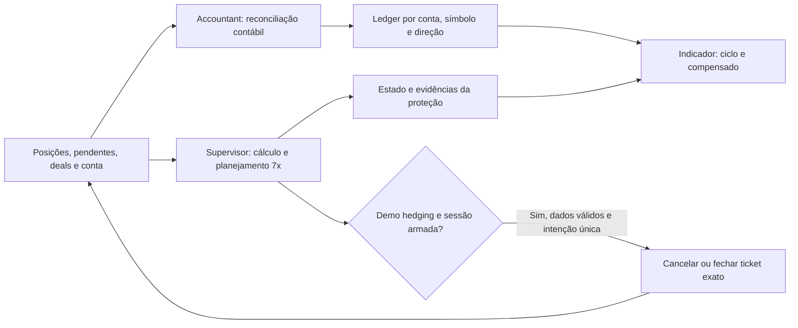
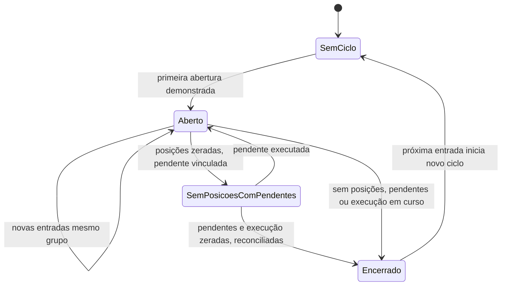

# GENETRIX — Pesquisa da proteção em 7x e do flutuante compensado

## Conclusão de aplicabilidade

Os contratos são implementáveis em um supervisor separado e em um ledger contábil próprio. A aplicabilidade operacional completa depende de demonstrar execução e recuperação no MT5 da corretora, além dos cálculos determinísticos. Esta edição documenta a pesquisa e o candidato isolado; a tabela de validação ao final informa o que foi efetivamente executado. Não constitui homologação da V11, autorização de conta real ou evidência de vantagem financeira.

O desenho separa quatro componentes: indicador observador existente, Accountant que publica a contabilidade, Supervisor que observa e pode reduzir exposição em demo explicitamente armada, e armazenamento independente para cada responsabilidade. O indicador não ganha capacidade de negociar. O supervisor não abre operações nem altera stops ou alvos.

## Decisões e significado financeiro

A proteção adicional usa `L = N/E`, sendo `N` a soma dos valores absolutos dos nocionais abertos, convertidos à moeda da conta, e `E` a equity atual. A comparação usa o valor calculado sem arredondamento de apresentação. Assim, 7,00001x exige ação mesmo que o painel mostre 7,00x; exatamente 7x não inicia nova poda. A leitura posterior deve incluir alterações de preços, custos, posições e equity.

O teto 7x foi escolhido para esta proteção técnica. Na V11 observada, art. 4.5, p. 36, os tetos das seis fases são 1 / 4 / 2,4 / 1,4 / 0,8 / 0,4, com denominador `min(Saldo Inicial, Equity)`. O 7x localizado na p. 79 refere-se a distância de stop em ATR. Logo, obedecer a este supervisor não demonstra obedecer às fases da V11. As pendências normativas e os estados `PENDING`, `NOT_HOMOLOGATED` e `BLOCKED` permanecem preservados.

LIFO significa a posição mais recente, e não necessariamente a de maior lote, perda ou nocional. A última instrução aprovada especifica fechamento integral em LIFO global, incluindo posições manuais e de outros EAs. O art. 7.1 da V11, pp. 60–61, fundamenta a sequência pendentes antes de posições; sua aplicação normativa completa exige as demais condições do modelo. A poda técnica não declara infração anterior nem substitui o DD operacional.

Fechar uma posição transfere seu flutuante já reconhecido na equity para o saldo. Essa transferência, isoladamente, não cria capital. Spread, comissão, taxas, deslizamento e novos movimentos podem reduzir a equity; por isso a exposição não é recalculada apenas subtraindo o nocional fechado. A série de ações pode precisar de outra poda, sempre após reconciliação.

### Exemplos determinísticos de risco

| Situação sintética | Cálculo | Comportamento contratado |
|---|---|---|
| N=7.000; E=1.000 | L=7 | Não iniciar nova poda |
| N=7.000,01; E=1.000 | L=7,00001 | Fechar posição mais recente integralmente |
| N=6.500; E cai a 900 | L≈7,2222 | Reagir mesmo sem nova entrada |
| Posições antiga 2.000, intermediária 2.500, recente 2.000; E=900 | Antes 6.500/900; após retirada recente 4.500/900=5 | Fechar a recente; confirmar exposição posterior |
| N=6.000; E=1.000; pendentes antiga 500 e recente 800 | B=1.000; pendentes 1.300 | Cancelar recente 800; remanescente 500 cabe |
| N=6.500; E=900; pendentes 100 e 200 | B=0 | Cancelar recente 200 e depois 100 antes de selecionar posição |
| Fechamento integral executa parcialmente | Intenção continua sobre o mesmo identificador | Concluir remanescente antes de selecionar outro membro |

Estes números são cenários, não previsões de preços ou da corretora. As referências congeladas encontram-se em `tests/fixtures/genetrix/risk-oracles-v1.json` e não podem ser ajustadas para produzir aprovação.

### O que LIFO pode fazer a um hedge

Considere, apenas como exemplo, compra equivalente a 7.000 e venda equivalente a 6.000 no mesmo instrumento, equity 1.000. O nocional bruto é 13.000, mas o líquido direcional é 1.000. Se a venda for a mais recente, LIFO a remove: o bruto cai para 7.000, enquanto o líquido direcional aumenta para 7.000. O limite bruto foi atendido e a sensibilidade direcional aumentou. O protocolo demo deverá registrar esse efeito usando inventário completo antes/depois e histórico. O código candidato registra ação e bruto/equity; não calcula nem registra automaticamente a variação do líquido direcional. Essa apuração é uma evidência adicional do ensaio, sem escolher outro ticket ou transformar o supervisor em otimizador de hedge. Correlação, margem, risco até o stop e exposição líquida precisam ser examinados na revisão demo; gross leverage não mede todos eles.

## Execução MT5: evidências primárias e contratos

A MetaQuotes documenta que `OrderSend` pode retornar verdadeiro sem execução concluída. O retorno da corretora, o pedido ativo, o histórico e o estado efetivo do ticket são necessários à reconciliação. Uma solicitação não é registrada como fechamento apenas pelo booleano. [OrderSend](https://www.mql5.com/en/docs/trading/ordersend).

Em hedging, o fechamento por símbolo pode escolher o menor ticket. A identidade alvo será conferida imediatamente antes do pedido, que usará o ticket específico. O `POSITION_IDENTIFIER` permite acompanhar a posição quando seu ticket muda, inclusive em operações de serviço. [PositionClose](https://www.mql5.com/en/docs/standardlibrary/tradeclasses/ctrade/ctradepositionclose), [Position Properties](https://www.mql5.com/en/docs/constants/tradingconstants/positionproperties).

Os eventos de transação abrangem ações manuais, de EAs e do servidor, mas a documentação não garante ordem de chegada; a fila também é limitada. O evento é um sinal para reconciliar, e não uma sequência contábil completa. Disso decorre uma limitação: um supervisor externo não veta antecipadamente qualquer ordem enviada por celular ou outro terminal. Ele cancela pendentes conhecidas e reage à exposição efetivamente capturada. [OnTradeTransaction](https://www.mql5.com/en/docs/event_handlers/ontradetransaction).

O timer pede um intervalo de um segundo. Eventos do mesmo timer podem ser agregados quando um já está pendente ou em processamento; rede, terminal e servidor também interferem. Medir excesso→detecção→solicitação→execução→reconciliação em demo; não prometer latência fixa. [OnTimer](https://www.mql5.com/en/docs/event_handlers/ontimer).

A execução requer simultaneamente permissões do terminal, programa, conta e corretora, conta demo hedging, ausência de FIFO obrigatório e dados válidos. Netting mistura posições do mesmo instrumento e permite reversão mantendo identificador: a política desta primeira versão não se transfere automaticamente a esse regime. Netting fica indisponível para execução. [Account Information](https://www.mql5.com/en/docs/constants/environment_state/accountinformation), [Trade Permission](https://www.mql5.com/en/docs/runtime/tradepermission).

### Pesquisa de netting: decisões ainda necessárias

| Questão | Hedging desta versão | Obstáculo no netting |
|---|---|---|
| Identidade | Cada posição tem identificador e ticket selecionáveis | Entradas de vários agentes compartilham posição por instrumento |
| Direção e Gênese | Ciclos compra e venda permanecem separados | Reversão INOUT pode conservar o identificador, exigindo divisão econômica do deal |
| LIFO integral | Ordena posições físicas por abertura | “Última ordem” e posição física não representam a mesma unidade de fechamento |
| Custos e volume | Reconcilia entradas, saídas e remanescentes por membro | Precisa definir atribuição de volume, custos e resultado entre segmentos do ciclo |

A pesquisa sustenta manter execução e contabilidade operacional v1 limitadas a hedging. Um futuro suporte netting exige contrato próprio de segmentação, reversões, mistura de agentes, custos e encerramento, com fixtures e testes de corretora. Não é uma simples troca de flag; permanece sem implementação/validação nesta versão. O caso de reversão mantendo identificador está documentado em [Position Properties](https://www.mql5.com/en/docs/constants/tradingconstants/positionproperties).

### Máquina de decisão e prevenção

O orçamento de entradas é `B=max(0,7E−N)`. Todas as pendentes ampliadoras são consideradas conjuntamente pelo volume restante e pelo preço planejado, com conversões da mesma captura. A soma não presume exclusividade entre ordens. Cancelar a mais recente, reconciliar e recalcular; repetir apenas enquanto a projeção exceder o orçamento. A projeção é condicionada às cotações capturadas e ao preço planejado, não uma garantia de preço futuro. Stop-limit usa o preço da ordem limite, conservando o preço de disparo na identidade; conversões Forex com a perna do próprio símbolo usam a taxa planejada nessa perna e capturas nas demais. Rotas ou contratos que o adaptador não sustenta produzem N/A e impedem execução.

Quando uma pendente executa durante o cancelamento, ordem terminal isolada não libera a intenção. O candidato exige vínculo ordem → deals de entrada → identificador da posição e conciliação do volume de entradas/saídas com o inventário ou encerramento posterior comprovado. Grava esse testemunho antes de liberar UNKNOWN. Seleção por posição e enumeração do histórico são operações distintas; seleção posterior de um único deal pode redefinir a lista e deve ser evitada nessa enumeração. [HistorySelectByPosition](https://www.mql5.com/en/docs/trading/historyselectbyposition), [HistoryDealGetTicket](https://www.mql5.com/en/docs/trading/historydealgetticket).

Esta implementação limita essa reconciliação a 2.048 deals por posição dentro do orçamento de leitura. Seleção incompleta, correção cancelada ou reversão sem suporte conserva UNKNOWN e proteção incompleta. O limite impede afirmar completude a partir de um prefixo; cenários acima dele exigem revisão posterior da estratégia de paginação.

Uma única intenção durável antecede uma solicitação. O registro deve distinguir: captura→plano→identidade/volume conferidos→intenção persistida→pedido→retorno→execução observada→exposição posterior. Uma falha de gravação impede o envio. Eventos desconhecidos, ordens ainda ativas e resultados incertos impedem outro pedido.

| Ocorrência | Resposta esperada | Informação mantida |
|---|---|---|
| Cancelamento definitivamente recusado | Proteção incompleta; não repetir silenciosamente; reduzir posições se excesso aberto | Ticket recusado e motivo; novo armamento explícito para tentar cancelamentos outra vez |
| Fechamento LIFO definitivamente recusado | Pausar; não saltar para posição anterior | Intenção, retorno e excesso conhecido |
| Desfecho incerto / timeout | Reconciliar; sem nova solicitação por decurso de tempo | Pedido/ordem/deal e volume alvo |
| Parcial pelo servidor | Concluir residual da mesma intenção após pedido anterior deixar de estar ativo | Identificador estável e volume observado |
| Desconexão / cotação inválida | Observação limitada; impedir execução | Motivo e últimos dados históricos, sem rotulá-los atuais |
| Instância duplicada | Impedir segundo executor no mesmo terminal/conta | Dono e estado do bloqueio |
| Reinício / troca de conta | Desarmar; recuperar intenção; sem reenvio automático | Conta/servidor/sessão e necessidade de reconciliação |
| Dois terminais diferentes | Exclusão local não garante exclusão entre terminais/VPS | Exigir um único supervisor autorizado na conta durante demo |

## Contabilidade: ciclo inferido desde a Gênese

A unidade contábil é `(conta, servidor, moeda, símbolo exato, direção)`. MagicNumber não restringe membros. O primeiro deal de abertura após zeragem reconciliada inicia o ciclo, salvo continuidade mantida por pendentes vinculadas. Uma pendente anterior à primeira abertura é metadado provisório; não inicia resultado financeiro nem recebe valor completo zero. Entradas posteriores do mesmo grupo integram o ciclo. Símbolo ou direção diferentes produzem ciclos separados.

A Gênese inferida é uma classificação contábil explícita. Sua identidade histórica permanece quando fecha. A posição remanescente não passa a ser nova Gênese. Empates de primeira abertura em milissegundos tornam a identidade individual ambígua; se os membros e início são conhecidos, o agregado continua calculável com esse aviso.

A V11 define Operação formal por tese, instrumento, direção, identificação e condições de encerramento. Seu art. 8.4 §27, p.73, admite reduzir ou zerar a Gênese em condições específicas; as exigências de confirmação e encerramento formal não são reproduzidas pela inferência contábil. O nome na tela será “ciclo contábil inferido”, evitando certificar uma Operação formal.

### Memória e reconciliação

O ledger conserva ciclos, membros com `POSITION_IDENTIFIER`, deals e revisões. Reprocessar um deal idêntico não soma outro resultado. Correções e exclusões geram revisões auditáveis e nova reconstrução. Associação ao membro decorre de IDs da posição/ordem e evidência econômica; sem prova, cobranças ficam separadas.

`HistorySelect` seleciona o intervalo de histórico solicitado e retorna sucesso ou falha. Seu sucesso não demonstra que o servidor oferece todo o ciclo desde a origem. Uma reconstrução deve comparar membros, volumes, pendentes, intervalos e evidência da zeragem. Por padrão o Accountant considera histórico e custos incompletos. Seus controles explícitos de cobertura exigem referência e identidade de conta compatível; a publicação registra cobertura DECLARADA pelo operador, não verificada automaticamente. Conflitos de membros/custos reduzem a cobertura mesmo com declaração. O revisor deve conferir o documento indicado antes de aceitar essa premissa. Fontes incompletas produzem cobertura parcial, sem inventar uma Gênese. [HistorySelect](https://www.mql5.com/en/docs/trading/historyselect).

Capturas de histórico, posições e pendentes não são atomicamente fornecidas pelo terminal. Mudanças detectadas pelas conferências rejeitam a amostra ou reduzem sua qualidade. As guardas não demonstram detectar todas as corridas de mesmo tamanho ou mudanças ABA; preencher uma pendente enquanto se cancela exige reconciliação para evitar encerramento prematuro do ciclo. SQLite/transações locais e gerações de publicação podem proteger a consistência persistida, mas precisam de teste real no MT5 e não controlam a atomicidade do servidor.

### Fórmulas e custos

`Contabilizado = Σ(DEAL_PROFIT + DEAL_SWAP + DEAL_COMMISSION + DEAL_FEE)` dos deals atribuídos.

`Flutuante = Σ(POSITION_PROFIT + POSITION_SWAP)` das posições remanescentes atribuídas.

`Compensado = Contabilizado + Flutuante`.

`Compensado % = 100 × Compensado / saldo atual da conta`. Em uma publicação atual, o saldo é o capturado nessa mesma geração. Em registros Historical e ciclos encerrados conservados, o percentual usa o saldo da observação registrada e sua data; não recebe rótulo de percentual da conta atual. A atualização exige nova publicação reconciliada.

A documentação expõe esses campos monetários separados. Comissões de abertura entram quando debitadas; parciais e rollover precisam reconciliar valores realizados e remanescentes sem duplicar swap. Deals cancelados e ajustes de saldo exigem tratamento específico e comprovação do vínculo. [Deal Properties](https://www.mql5.com/en/docs/constants/tradingconstants/dealproperties).

Não estimar uma comissão futura de saída como custo já observado. A métrica descreve valores contabilizados e flutuantes conhecidos; não é promessa de liquidação líquida futura. Aporte/retirada muda o denominador percentual da conta, mas não entra no resultado do ciclo. Créditos, cashback e custos sem vínculo não são distribuídos arbitrariamente. Subtotal sem atribuição suficiente não recebe classificação líquido completo.

| Exemplo sintético | Contabilizado | Flutuante | Compensado | Saldo atual / % |
|---|---:|---:|---:|---:|
| Entrada com comissão −2,20; posição 50 e swap−0,50 | −2,20 |49,50|47,30|997,80 / 4,74%|
| Parcial, custos observados incluídos |16,72|29,70|46,42|1.016,72 / 4,57%|
| Gênese fecha; defesa permanece |44,00|−12,40|31,60|1.044 / 3,03%|
| Nenhuma posição, pendente mantém ciclo |40,00|0|40,00|1.040 / 3,85%|
| Custos tardios 3 vinculados ao caso da parcial |13,72|29,70|43,42|1.013,72 / 4,28%|
| Mesma escala em USC, valores multiplicados por 100 |−220|4.950|4.730|99.780 / 4,74%|

As contas pertencem a fixtures congelados e incluem arredondamento apenas de apresentação. USC permanece na unidade monetária nativa e não justifica multiplicar contratos arbitrariamente. Um custo sem vínculo no quinto exemplo manteria o subtotal 46,42, sinalizado parcial; não reduziria o ciclo silenciosamente.

Compensado positivo não reduz automaticamente Risco Comprometido, não compensa custos negativos para orçamento, não reabre autorização e não altera fases. O percentual pode mudar por aportes com o mesmo lucro monetário: esse efeito precisa ser explicado ao usuário.

## Tela e usabilidade

A sétima métrica apresenta moeda, valor, percentual e ciclo selecionado. A seleção é explícita quando houver vários ciclos, por instrumento/direção e ID. Componentes, Gênese inferida, identificadores dos membros observados — inclusive fechados —, cobertura, estado e atualização ficam nos detalhes paginados. A lista apresenta POSITION_IDENTIFIER históricos da mesma geração, sem inferir ticket atual; cobertura parcial não afirma origem completa. Publicação antiga sem lista mantém membros indisponíveis. A métrica global Floating P/L existente permanece com seu escopo próprio.

Preferências V3 preservam os seis bits anteriores e migram V1/V2 sem reexibir métricas quando o usuário havia escondido todas. Atalho7 corresponde à nova métrica; estados visualmente incompletos não serão confundidos com zero. Publicação stale permanece histórica ou indisponível. O indicador lê o ledger, sem escrever na contabilidade, armar ou executar o supervisor.

## Especialistas, autores e revisores

As frentes têm responsabilidades separadas: risco quantitativo (nocional/equity/conversões/hedge), execução MT5 (retornos, concorrência, ticket, parcial), contabilidade/persistência (replay, custos, recuperação), governança (autoridade e lacunas V11) e teste/interface (oracles, falhas e apresentação). Os módulos foram distribuídos entre especialistas de risco, dados e interface, coordenados por uma revisão de integração. Revisões cruzadas examinam o candidato congelado; a autoria de um módulo não constitui sua aprovação independente.

Agentes de IA aumentam cobertura de revisão, mas não equivalem a certificação profissional externa ou garantem independência absoluta de pressupostos. Os pareceres devem apontar evidências e limitações concretas, registrando falhas encontradas antes das correções. Modificação após revisão exige refreeze dos arquivos afetados e repetição dos testes pertinentes.

## Matriz de aplicabilidade e roteiro de validação

| Evidência necessária | Verificação local possível | Prova ainda necessária no MT5 |
|---|---|---|
| Fórmula e limite estrito em 7x | Código MQL puro efetivo via adaptador compilado, oracles independentes | Contratos/cotações do perfil real da corretora |
| LIFO, orçamento das pendentes, parcial/unknown | Cenários sintéticos e máquina de estados | Retornos reais, ordens ativas, preenchimentos e latências |
| Ledger, replay e revisões | Código efetivo, banco isolado, recuperação/corrupção | Histórico oferecido pelo servidor e cobranças reais |
| Tela/prefs/ciclos | Helpers reais, codec e eventos simulados | Layout, DPI, temas, persistência e atualização visual |
| Bloqueios demo/FIFO/netting/permissões | Guards e cenários sintéticos | Estado efetivo, terminal e perfil da corretora |
| Exclusão e intenção durável | Falhas e reinícios em armazenamento local | Multigráficos, reinício do terminal, rede e recuperação |

1. Congelar fontes, fixtures, versões, hashes, critérios, build e perfil de corretora.
2. Executar testes locais do código efetivo e regressões, preservando todas as tentativas.
3. Revisar os módulos por autores diferentes; corrigir falhas e congelar novo candidato.
4. Compilar os bytes exatos em MetaEditor; registrar comando/build/log/hashes de cada EX5.
5. Em demo hedging dedicada, primeiro observação; comparar captura com terminal e histórico.
6. Armar somente a conta/servidor/sessão aprovados; executar cada cenário crítico em três sessões novas. Não abrir posições por mecanismo oculto do supervisor.
7. Registrar tempos, pedidos, retornos, deals, posição posterior e tela. Avaliar perda de hedge, custos e efeito da retirada integral.
8. Uma falha crítica bloqueia aprovação do candidato no escopo; médias ou lucros não compensam. Publicação e conta real dependem de revisão posterior do candidato concreto.

## Proveniência e manutenção

Base: snapshot isolado da revisão `deffc5061fe2eff3d83b6f6e742fa105ac9c5b06`, incluindo mudanças correntes do checkout do site na captura, preservadas no manifesto `BASELINE-INPUTS.json`. Não se declara que a árvore original estava limpa. Diretório original: `/private/tmp/jpw-cockpit-ui-20260930`; candidato: `/private/tmp/jpw-genetrix-risk-ledger-20261001`. Nenhuma integração no site ou alteração de seus fontes originais é feita nesta entrega.

Fontes documentais observadas: Estatuto V11 SHA256 `2dab6166bb8513cd9beb7fe39c574971af086ebae66683d99c0e6fac69eb6769`; Anexo T03 `6240b6330a35fd488f16d4191129eeb01aff8f7a4707158c043afb37d91cdc23`; Master engenharia 2.0 `b5680c22e44cf3f4a5cd3aa5deeb96f8b65c7908f14543e8c5d7f0c2f4e17b95`. Passagens utilizadas acima não conferem autorização normativa ao software.

Rever versões, vigência e diferenças de conteúdo antes da futura integração. Fonte modificada suspende somente conclusões afetadas e abre nova revisão. Não substituir o modelo vigente por número de arquivo ou pesquisa. Persistir recibos, falhas e estados de teste sem apagá-los para obter aprovação.

## Estado da entrega

A consolidação final de testes, revisões e hashes consta em `GENETRIX-VALIDACAO-20261001.md` e nos recibos da entrega. `CANDIDATE` não significa implantado. Compilação nativa, inspeção visual MT5 e demo permanecem `NOT_RUN` enquanto não houver recibos correspondentes; nenhum EX5 será distribuído sem vínculo comprovado com os fontes.
